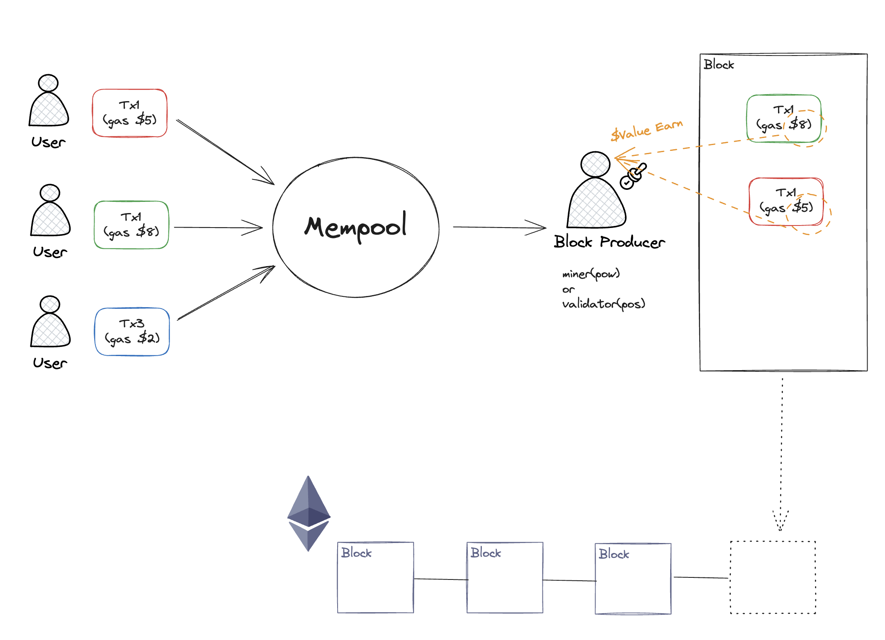

<!-- _paginate: skip -->
# **MEV**

---

## What is MEV ?

- 블록을 생성하는 과정에서 트랜잭션의 순서를 변경하거나, 추가, 제외등을 통하여, 블록을 생성하는 miner 혹은 validator가 만들 수 있는 최대 가치.

---

## Block Produce



---

<!-- _class: lead -->
## 대기 중인 트랜잭션 중에서 가스비를 가장 많이 제출한 트랜잭션을 우선적으로 블록체인에 기록

---

<!-- _class: lead -->
## 블록 생성자는 블록체인에서

## 트랜잭션이 처리되는 순서를 결정할 수 있으며

## 이 권한을 자신에게 유리하게 활용할 수 있다

## -> 유저에게는 해를 끼칠 수 있다

---

<!-- _class: lead -->
## MEV는 이미 POW에서도 있었던 개념

## Miner Extractable Value

---

<!-- _class: lead -->
## Maximal Extractable Value

## vs

## Miner Extractable Value

---

### Miner Extractable Value : Miner가 추출하던 가치

### Maxiaml Extractable Value

1. PoS 전환 이후 Miner가 하던 일을 Validator가 대체
2. Miner는 이더리움 프로토콜의 개념이 아님

## -> 용어가 변경됨

---

## MEV History

### "Flash Boys 2.0"

 MEV와 트랜잭션 재정렬을 단순한 이론적 개념이 아니라 탈중앙화 거래소에서 트랜잭션 프론트러닝의 형태로 이미 대규모로 일어나고 있으며 사용자 경험에 큰 영향을 미칠 수 있는 역학 관계로 설명

### MEV 누적 가치

2021년 초 : 7,800만 달러
2021년 말 : 5억 5,400만 달러

---

## MEV EXTRACTION

- 이론적 : MEV 기회를 실행할 수 있는 Validator에 의해 전적으로 발생
- 실제 :
  - Searcher에 의해 추출.
  - MEV 기회를 찾기 위한 알고리즘이 필요. 이것은 매우 복잡함.
  - 수익성이 있는 거래를 찾아서 봇이 자동으로 네트워크에 제출
  - Searcher에 의해 MEV를 추출하더라도, Validator는 어쨌든 MEV 금액의 일부를 얻게 됨.

---

- WHY ?
  - Validator가 실제 블럭 생성 처리를 함
  - Searcher가 찾은 MEV 기회는 블럭에 포함되어야 수익이 날 수 있음.
    -> Searcher는 높은 가스 수수료를 지불할 의사가 있음
  - Searcher가 지불하려는 가스 요금은 MEV의 최대 100%가 될 것
    - MEV == Gas Fee 인 경우, 똔똔
    - MEV < Gas Fee 인 경우, Searcher는 손실
  - 경쟁이 치열한 MEV 기회(DEX 차익거래)의 경우, Searcher는 총 MEV 수익의 90% 이상을 검증자에게 가스 수수료로 지불해야 할 수 도 있음
    - 동일한 기회를 포착한 사람이 많을 수 있고, 블록에 들어가도록 보장 받기 위해서는 높은 가스 가격으로 거래를 제출해야 하기 때문

---

## How to MEV EXTRACTION ?

### Gas golfing

- 가스 수수료 = 사용한 가스 * 가스 값
- Searcher가 더 높은 가스 가격을 제안할 수 있다
-> 블록에 포함될 확률이 더 높아짐
- 결국, `사용하는 가스를 최소화` 하는 것이 더 높은 가스 값을 제안할 수 있게 됨

---

몇 가지 잘 알려진 Gas Golf 기술

1. 최대한 많은 0으로 시작하는 주소를 사용
   - 예: [Address 0x0000000000c521824eaff97eac7b73b084ef9306](https://etherscan.io/address/0x0000000000c521824eaff97eac7b73b084ef9306)
   - 주소 저장에 더 적은 공간을 사용
2. Contract에 ERC20 토큰의 매우 작은 양을 남겨둠
   - 저장소 슬롯 초기화(잔액이 0인 경우)에 사용하는 가스양 > 저장소 슬롯 업데이트에 사용하는 가스양

---

### Frontrunners

- 멤풀에서 수익성 있는 transaction을 모니터링 하는 Bot
- 동작
  - 잠재적으로 수익성이 있는 거래의 코드를 복사
  - Frontrunner의 주소로 교체
  - 로컬에서 시뮬레이션
  - Frontrunner의 주소에서 수익이 발생하는 체크
  - 수익이 발생한다면, 더 높은 가스 가격으로 수정된 거래를 제출
  - 원래 거래를 선행하고 MEV를 얻음

---

- Frontrunners의 선행매매 방지를 위해 "Flashbots" 등장
- `Flashbots`
    -> Searcher가 MEV 트랜잭션을 공개 멤풀에 공개하지 않고, 검증자에게 제출할 수 있는 서비스를 통해 실행 클라이언트를 확장하는 프로젝트

---

### DEX arbitrage

- 가장 간단하고 잘 알려진 MEV 기회

- 방법
  - 두개의 DEX에서 서로다른 두가지 가격으로 토큰을 제공하는 상황
  - 토큰의 가격이 더 낮은 DEX에서는 구매 -> 토큰 가격이 높은 DEX에서 매도를 한 트랙잭션으로 처리
  - 예시) [Ethereum Transaction Hash \(Txhash\) Details](https://etherscan.io/tx/0x5e1657ef0e9be9bc72efefe59a2528d0d730d478cfc9e6cdd09af9f997bb3ef4)
    - Aave v2에서 1,000 ETH Flash Loan
    - Uniswap V2에서 1,000 ETH ->  DAI
    - Sushiswap 에서 DAI -> 1045 ETH
    - 45 ETH 수익

---

### Liquidations

- 대출 프로토콜의 청산으로 MEV 기회를 얻음
- 방법
  - Maker 혹은 Aave에 담보 자산 예치
  - 다른 유저가 자산을 빌려감
  - Searcher가 블록체인 데이터를 최대한 빨리 분석하여 어떤 차용자가 청산될 수 있는지 결정
  - 가장 먼저 청산 트랜잭션을 제출
  - 청산 수수료를 수집
    - 차용인(자산을 빌려간 유저)는 상당한 청산 수수료를 지불(일부가 청산인에게 전달)하기 때문

---

Sandwich trading

- 슬리피지를 이용한 샌드위치 거래로 MEV 추출
- 방법
  - Searcher는 대규모 DEX 거래를 위해 멤풀 모니터
    - 대규모 거래는 가격에 영향을 줌
  - 대규모 거래의 대략적인 가격 효과를 계산
  - 대규모 거래 직전에 최적의 매수 주문 실행 (자산을 저렴하게 구매)
  - 대규모 거래
  - 대규모 거래 직후 매도 주문을 실행하여 높은 가격으로 매도

---

- 리스크
  - 샌드위치는 단일 트랜잭션으로 처리 불가(DEX 차익거래와 다름)
  - 살모넬라(salmonella attack) 공격에 취약

살모넬라 공격

- 샌드위치는 대규모 거래에 의한 슬리피지를 이용하여 매수 매도 하여 수익을 창출 하는 방법
- 사전에 대규모 거래에 대한 예상을 기반으로 함
- 그러나 대규모 거래가 성공하지 못 할 경우 쓸모없는 토큰을 대량 보유할 수 있게 됨

---

- `Flashbots`의 등장으로 “샌드위치 번들”을 생성할 수 있게 됨
  - 샌드위치 번들은 3개의 트랜잭션 (선매수, 대규모 교환, 후매도) 모두 실행되거나, 아무것도 실행되지 않음
- 샌드위치 번들을 블록에서 직접 채굴하는 마이너 트레이딩 팀도 증가
- “샌드위치 번들”과 마이너 트레이딩 팀의 증가 => 샌드위치 트레이더들에게 “무위험”알파 수익의 안일함을 가져옴.
- 프론트러닝의 일반화된 특성을 악용하는 “살모넬라” 공격 등장

---

- 방법
  - 일반적인 ERC20 토큰을 구현
  - 지정된 소유자 이외의 다른 사람이 거래하는 경우, 지정된 금액의 10%만 반환하는 기능 추가
  - 풀 생성 및 등록
  - 미끼 거래 추가
  - 실행 아키텍처를 코딩하여 거래를 신속하게 취소하고, 가스 가격을 변경하고, 트랩 유니스왑 풀의 상태를 재설정할 수 있는 기능을 제공
  - 미끼를 통해 샌드위치 트레이딩 하도록 유도

---

- 샌드위치 거래가 수행 되면,
  - 선매수시 지급되는 금액의 10%에 해당하는 자산만 지급
  - 대규모 트레이딩
  - 후매도시 선매수 수량(지급금액의 10%에 해당)만 매도
  - 이 사이의 갭을 탈취
- [Salmonella \(SLM\) Token Tracker](https://etherscan.io/token/0x610b8b78da143fc1e38b36c4ea0f68f86cc3b4f4)

---
Salmonella 전송 함수

```solidity
function _transfer(address sender, address recipient, uint256 amount) internal virtual {
  require(sender != address(0), "ERC20: transfer from the zero address");
  require(recipient != address(0), "ERC20: transfer to the zero address");
  uint256 senderBalance = _balances[sender];
  require(senderBalance >= amount, "ERC20: transfer amount exceeds balance");
  if (sender == ownerA || sender == ownerB) {
    _balances[sender] = senderBalance - amount;
    _balances[recipient] += amount;
  } else {
    _balances[sender] = senderBalance - amount;
    uint256 trapAmount = (amount * 10) / 100;
    _balances[recipient] += trapAmount;
  }
  emit Transfer(sender, recipient, amount);
}
```

---

### NFT MEV

- 반드시 수익성이 있지는 않음
- 단일 거래 또는 NFT가 실수로 낮은 가격에 상장된 경우, Searcher는 다른 구매자를 선점하여 저렴한 가격에 구매할 수 있음

---

## MEV Effects

### Good

합리적인 Searcher가 경제적 비효율성을 찾아 해결하고 프로토콜의 경제적 인센티브를 활용하지 않는다면, 일반적으로 디파이 프로토콜과 디앱은 지금처럼 강력하지 않을 수 있다

- DEX 차익거래는 사용자가 토큰에 대해 가장 정확하고 가장 좋은 가격을 얻을 수 있도록 보장
- 대출 프로토콜은 대출자가 상환받을 수 있도록 차용자가 담보 비율 아래로 떨어지면 신속한 청산에 의존

---

### Bad

1. 샌드위치 트레이딩을 하는 사용자는 슬리피지가 증가하고 거래 체결이 더 나빠진다.
2. 두 명 이상의 Frontrunner가 가스 가격 경쟁하는 경우, 네트워크 혼잡 발생 + 다른 모든 사용자에게 높은 가스 가격이 부과
3. MEV가 블록 보상을 크게 초과하는 경우, Validator는 블록을 재구성하고 스스로 MEV를 확보하려는 인센티브를 받을 수 있으며, 이는 블록체인의 재구성 및 합의 불안정을 초래할 수 있음
4. 블록 재구성 가능성은 이전에 비트코인에서 발견됨
거래 수수료가 블록 보상에서 차지하는 비중이 커짐에 따라 블록의 보상을 포기하고 수수료가 더 높은 과거 블록을 채굴하는 것이 경제적으로 합리적이 되는 상황이 발생. 블록체인의 무결성을 위협

---

## STATE OF MEV

- '21년 초 MEV 추출이 급증하여 몇 달 동안 높은 가스 가격 형성
- Flashbots의 MEV Relay가 등장
  - Frontrunner 감소
  - 가스 가격 경매가 오프체인에서 이루어지면서 일반 사용자들의 가스 가격 감소

- 더 많은 Searcher 등장 및 경쟁
  - Flashbots에서도 가스 경매가 비공개적으로 진행
  - Validator가 더 많은 MEV 수익을 가져가게 됨(Validator가 결과 가스 수익을 가져감)

---

- 경쟁이 과열됨에 따라 Searcher들은 MEV기회가 존재하나 경쟁이 낮은 체인으로 이동중
- PoS 전환, 롤업, 샤드등 이더리움의 확장에따라 MEV 환경 및 기회가 변화중

---

## MEV in POS

- 이더리움이 POS로 전환함에 따라 잠재적으로 새로운 MEV관련 위험이 발생할 수 있음
- Merge 이후, 32ETH를 예치한 Validator들이 비콘 체인에 추가된 블록의 합의를 도출
- Validator의 중앙 집중화를 완화하고 보안을 개선하기 위해서는 솔로스테이커의 건전한 분포가 이상적

---

### Validator 중앙화

- MEV 추출은 Validator의 중앙화를 가속화 할 수 있음
- Validator(0.22ETH)가 Miner(2ETH)보다 블록 보상이 적으므로, MEV 추출이 Merge 이후 Validator 수익에 영향
- 더 큰 스테이킹 풀은 더 많은 MEV 기회를 만들 수 있음
- 단독 스테이커는 사용할 수 있는 리소스가 적기 때문에 MEV 기회에서 수익을 얻지 못할 수 있음
- 이는 독립적인 validator가 수익을 늘리기 위해 강력한 스테이킹 풀에 참여해야 한다는 압박을 가중시켜 이더리움의 탈중앙화를 감소시킬 수 있다

---

### 허가된 멤풀

- 샌드위치 공격과 Frontrunner 공격에 대응하기 위해 트레이더는 Validator와 오프체인 거래를 진행할 수 있음
- 잠재적인 MEV 트랜잭션을 공개 멤풀로 보내는 대신, Validator에게 직접 전송하고 수익을 쉐어

- **Dark pools**은 특정 수수료를 지불할 의사가 있는 사용자에게 개방된 허가된 접근 전용 멤풀
- 허가된 멤풀은 중앙화 위험을 가속화할 수 있음
- 'Merge'이후 MEV의 부정적인 영향을 줄이기 위한 연구가 주요 사항이 되었음
- 현재 이더리움에서 제안된 솔루션 : PBS, Builder API

---

## Proposal - Builder 분리 (PBS)

- 대부분의 MEV는 블록 생성자와 제안자의 조합에 의해서 발생함
  - 생성한 블록 위에 다른 블록을 추가(POW), 다른 검증자에의해 검증(PoS)
- PBS는 특히 합의 레이어에서 MEV의 영향을 완화하기 위해 설계
- Block Builder
  - 트랜잭션을 번들을 생성하고, 이를 비콘 체인 블록에 포함하기 위해 입찰

- Validator
  - 다음 블록을 제안하도록 선택된 Validator는 여러 입찰 중, 수수료가 가장 높은 번들을 선택

- PBS는 기본적으로 경매 시장을 생성, 여기서 Builder는 블록 공간을 판매하는 Validator와 협상

---

- 현재 PBS 설계에서는 커밋 공개 방식(Builder가 입찰과 함께 블록 헤더에 대한 암호화 커밋만 게시)을 사용
- 낙찰 입찰을 수락한 후 제안자는 블록 헤더가 포함된 서명된 블록 제안서를 생성
- 블록 생성자는 서명된 블록 제안서를 확인한 후 전체 블록 본문을 게시

---

### Proposal과 Builder 분리가 MEV의 영향을 어떻게 완화 하는가?

- 프로토콜 내 제안자와 블록 빌더의 분리는 검증자의 권한에서 MEV 추출을 제거하여 합의에 대한 MEV의 영향을 줄임
- 대신, 특수 하드웨어를 실행하는 블록 빌더가 앞으로 MEV 기회를 포착하게 됨

- 하지만 블록 생성자가 검증자에게 블록을 승인받으려면 높은 입찰가를 제시해야 하기 때문에 검증자가 MEV 관련 수입에서 완전히 배제되는 것은 아님
- 그럼에도 불구하고 검증자가 더 이상 MEV 수입을 최적화하는 데 직접적으로 집중하지 않기 때문에 타임 밴딧 공격의 위협은 감소된다

---

- 제안자와 생성자가 분리되면 MEV의 중앙화 위험도 감소
  - 예를 들어, 커밋 공개 방식을 사용하면 빌더가 검증자를 신뢰하여 MEV 기회를 훔치거나 다른 빌더에게 노출되지 않도록 할 필요가 없습니다. 이는 솔로 스테이커가 MEV의 혜택을 누릴 수 있는 장벽을 낮추며, 그렇지 않다면 빌더는 오프체인 평판을 가진 대형 풀을 선호하고 이들과 오프체인 거래를 진행하는 경향이 있을 것

  - 검증자는 무조건적인 지불이 이루어지기 때문에 블록체인을 보류하거나 유효하지 않은 블록을 게시하지 않을 것이라고 빌더를 신뢰할 필요가 없음. 제안된 블록을 사용할 수 없거나 다른 검증자가 유효하지 않다고 선언한 경우에도 검증자의 수수료는 처리됨. 후자의 경우, 블록은 단순히 폐기되어 블록 생성자는 모든 트랜잭션 수수료와 MEV 수익을 잃게 됨

---

## Builder API

- PBS는 MEV 추출의 영향을 줄일 수 있지만, 이를 구현하기 위해서는 합의 프로토콜을 변경해야 함
- 특히, 비콘 체인의 포크 선택 규칙 업데이트 필요.
- 빌더 API는 더 높은 신뢰 가정을 전제로 하지만 PBS의 작동하는 구현을 제공하기 위한 임시 솔루션

---

- Builder API는 합의 계층 클라이언트가 실행 계층 클라이언트에서 실행 페이로드를 요청하는데 사용하는 엔진 API의 수정된 버전
- 정직한 Validator 사양에 설명된 대로, 블록 Proposal 업무를 위해 선택된 Validator는 연결된 실행 클라이언트(flashbot builder)로부터 트랜잭션 번들을 요청하고, 이를 제안된 비콘 체인 블록에 포함합니다.

- Builder API역할
  1. Validtor와 실행 레이어 클라이언트 사이의 미들웨어
  2. 비콘 체인의 Validator가 로컬이 아닌 외부 엔티티에서 블록을 소싱할 수 있도록 도움

---

## Builder API의 작동 방식

- 빌더 API는 Validator를 실행 레이어 클라이언트를 실행하는 블록 Builder 네트워크에 연결
  - PBS에서와 마찬가지로 Builder는 리소스 집약적인 블록 생성에 투자하고 다양한 전략을 사용하여 MEV + 우선순위 팁에서 얻은 수익을 극대화하는 전문 당사자

- Validator(합의 레이어 클라이언트 실행)는 Builder 네트워크에서 입찰과 함께 실행 페이로드를 요청
- Builder의 입찰에는 실행 페이로드 헤더(페이로드 콘텐츠에 대한 암호학적 약속)와 검증자에게 지불할 수수료가 포함

---

- Validator는 수신된 입찰을 검토하여 가장 높은 수수료를 제시한 실행 페이로드를 선택
- Builder API를 사용하여 서명과 실행 페이로드 헤더만 포함된 "블라인드" 비콘 블록 제안을 생성하고 빌더에게 전송

- Builder API를 실행하는 Builder는 블라인드된 블록 제안을 보고 전체 실행 페이로드로 응답
- 이를 통해 Validator는 "서명된" 비콘 블록을 생성하여 네트워크 전체에 전파

---

- API를 사용하는 검증자는 블록 생성자가 즉시 응답하지 않는 경우에도 블록 제안 보상을 놓치지 않도록 로컬에서 블록을 생성할 것으로 예상됩니다. 그러나 검증자는 현재 공개된 트랜잭션이나 다른 세트를 사용하여 다른 블록을 생성할 수 없으며, 이는 동일한 슬롯 내에서 두 개의 블록에 서명하는 것과 같은 위법 행위에 해당합니다.

---

## How does MEV work?


---

- 제안자-구축자 분리는 MEV 추출의 영향을 줄일 수 있지만, 이를 구현하기 위해서는 합의 프로토콜을 변경해야 합니다. 특히, 비콘 체인의 포크 선택 규칙을 업데이트해야 합니다. 빌더 API(새 탭에서 열기)는 더 높은 신뢰 가정을 전제로 하지만 제안자-구축자 분리의 작동하는 구현을 제공하기 위한 임시 솔루션입니다.

빌더 API는 합의 계층 클라이언트가 실행 계층 클라이언트에서 실행 페이로드를 요청하는 데 사용하는 엔진 API(새 탭에서 열기)의 수정된 버전입니다. 정직한 검증자 사양(새 탭에서 열기)에 설명된 대로, 블록 제안 업무를 위해 선택된 검증자는 연결된 실행 클라이언트로부터 트랜잭션 번들을 요청하고, 이를 제안된 비콘 체인 블록에 포함합니다.

빌더 API는 검증자와 실행 레이어 클라이언트 사이의 미들웨어 역할도 하지만, 비콘 체인의 검증자가 실행 클라이언트를 사용하여 로컬로 블록을 구축하는 대신 외부 엔티티에서 블록을 소싱할 수 있다는 점에서 차이가 있습니다.

다음은 빌더 API의 작동 방식에 대한 개요입니다:

빌더 API는 검증자를 실행 레이어 클라이언트를 실행하는 블록 빌더 네트워크에 연결합니다. PBS에서와 마찬가지로, 빌더는 리소스 집약적인 블록 생성에 투자하는 전문 당사자이며 다양한 전략을 사용하여 MEV + 우선순위 팁에서 얻은 수익을 극대화합니다.

검증자(합의 레이어 클라이언트 실행)는 빌더 네트워크에서 입찰과 함께 실행 페이로드를 요청합니다. 빌더의 입찰에는 실행 페이로드 헤더(페이로드 콘텐츠에 대한 암호학적 약속)와 검증자에게 지불할 수수료가 포함됩니다.

유효성 검사기는 수신된 입찰을 검토하여 가장 높은 수수료를 제시하는 실행 페이로드를 선택합니다. 검증자는 빌더 API를 사용하여 서명과 실행 페이로드 헤더만 포함된 "블라인드" 비콘 블록 제안서를 생성하여 빌더에게 보냅니다.

빌더 API를 실행하는 빌더는 블라인드된 블록 제안을 보고 전체 실행 페이로드로 응답할 것으로 예상됩니다. 이를 통해 검증자는 "서명된" 비콘 블록을 생성하여 네트워크 전체에 전파할 수 있습니다.

빌더 API를 사용하는 검증자는 블록 생성자가 즉시 응답하지 않는 경우에도 블록 제안 보상을 놓치지 않도록 로컬에서 블록을 생성할 것으로 예상됩니다. 그러나 검증자는 현재 공개된 트랜잭션이나 다른 세트를 사용하여 다른 블록을 생성할 수 없으며, 이는 동일한 슬롯 내에서 두 개의 블록에 서명하는 것과 같은 위법 행위에 해당합니다.

빌더 API의 구현 예로는 이더리움에서 MEV의 부정적인 외부효과를 억제하기 위해 설계된 플래시봇 경매 메커니즘(새 탭에서 열기)을 개선한 MEV 부스트(새 탭에서 열기)가 있습니다. 플래시봇 경매를 통해 작업 증명 마이너는 수익성 있는 블록을 생성하는 작업을 검색자라고 하는 전문 당사자에게 아웃소싱할 수 있습니다.

서처는 수익성 있는 MEV 기회를 찾고, 블록에 포함하기 위해 밀봉 가격 입찰(새 탭에서 열기)과 함께 트랜잭션 번들을 채굴자에게 보냅니다. 고이더리움(Geth) 클라이언트의 포크 버전인 mev-geth를 실행하는 마이너는 가장 수익이 높은 번들을 선택하여 새 블록의 일부로 채굴하기만 하면 됩니다. 스팸과 유효하지 않은 트랜잭션으로부터 마이너를 보호하기 위해 트랜잭션 번들은 마이너에게 전달되기 전에 릴레이어를 통과하여 검증을 받습니다.

MEV 부스트는 이더리움의 지분 증명으로의 전환을 위해 설계된 새로운 기능이 추가되었지만, 기존 플래시봇 경매와 동일한 작동 방식을 유지합니다. 검색자는 여전히 블록에 포함할 수익성 있는 MEV 트랜잭션을 찾지만, 빌더라고 하는 새로운 종류의 전문 당사자가 트랜잭션과 번들을 블록에 통합하는 일을 담당합니다. 빌더는 검색자로부터 밀봉된 가격 입찰을 수락하고 최적화를 실행하여 가장 수익성이 높은 주문을 찾습니다.

릴레이어는 여전히 트랜잭션 번들을 제안자에게 전달하기 전에 유효성을 검사할 책임이 있습니다. 그러나 MEV Boost는 빌더가 전송한 블록 본문과 검증자가 전송한 블록 헤더를 저장하여 데이터 가용성을 제공하는 에스크로를 도입합니다. 여기서 릴레이에 연결된 검증자는 사용 가능한 실행 페이로드를 요청하고 MEV Boost의 주문 알고리즘을 사용하여 입찰가가 가장 높은 페이로드 헤더 + MEV 팁을 선택합니다.
