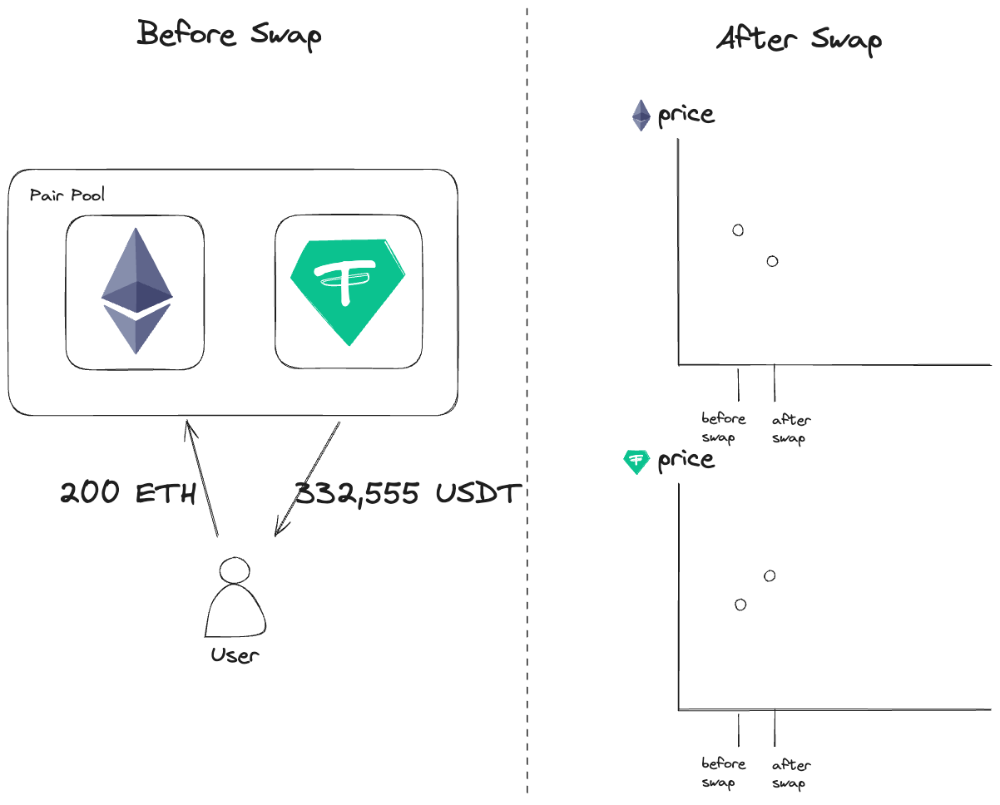
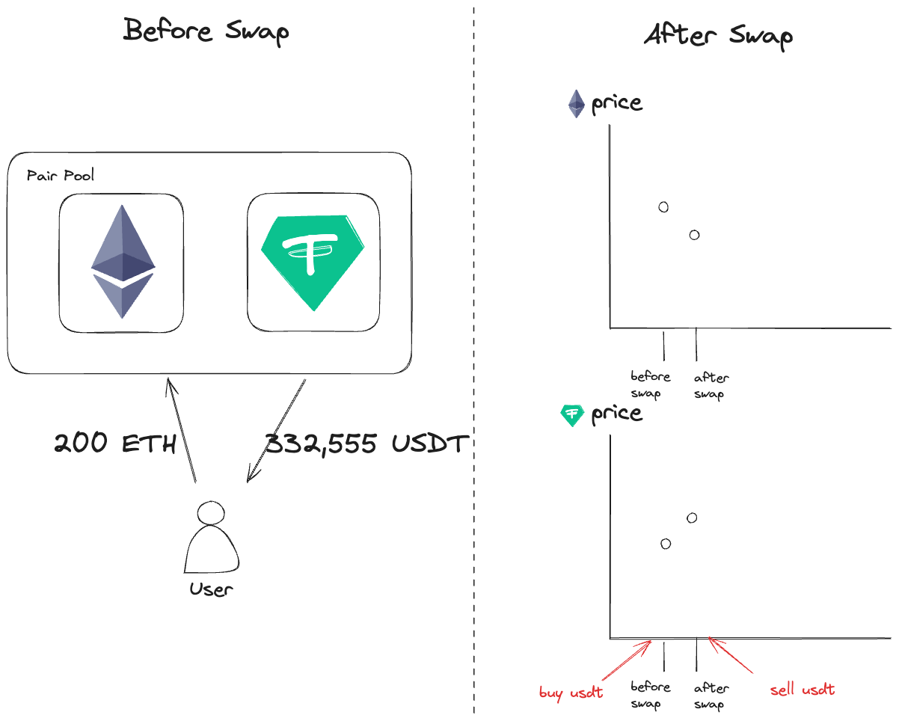
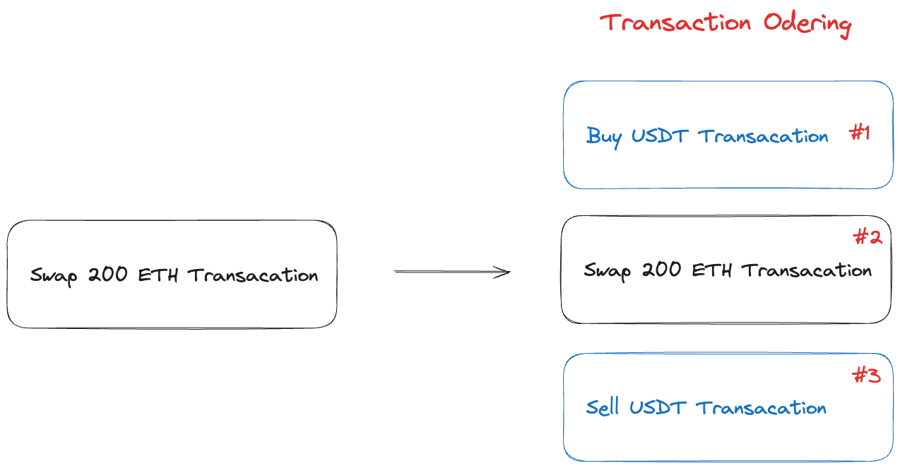

<!-- _paginate: skip -->

# **MEV DeepDive**

---

## Bundle & MatchMaker

#### MEV (Maximal Extractable Value)

---

---

### Transaction Ordering

- #2 Transaction 앞뒤로, #1, #3의 Transaction을 추가하여 처리 **순서를 조절** 하여 수익을 극대화함

- #1, #2, #3의 Transaction을 묶어서 **Bundle**로 구성

---

### Bundle

- 여러 트랜잭션을 하나의 그룹으로 묶은 것을 의미.
- 특정한 순서로 블록에 포함되어야 할 트랜잭션들로 구성.
- 예) 앞서 그림과 같이 #1, #2, #3의 순서로 블록에 포함. 이 순서를 지켜 트랜잭션을 실행해야 수익을 얻을 수 있다.

---

### MatchMaker

- 특정 트랜잭션들 사이에서 이익을 창출하기 위해 중개자 역할을 하는 개념
- 예) 한 사용자가 특정 토큰을 매우 낮은 가격에 판매하려고 하고 다른 사용자가 높은 가격에 구매하려고 할 때, Match Maker는 이 두 트랜잭션을 매칭하여 중간에서 차익을 얻을 수 있다.
- 이 과정에서 Match Maker는 두 트랜잭션을 적절히 조정하여 블록에 포함시키는 역할을 한다.

---

# 감사합니다.

---
